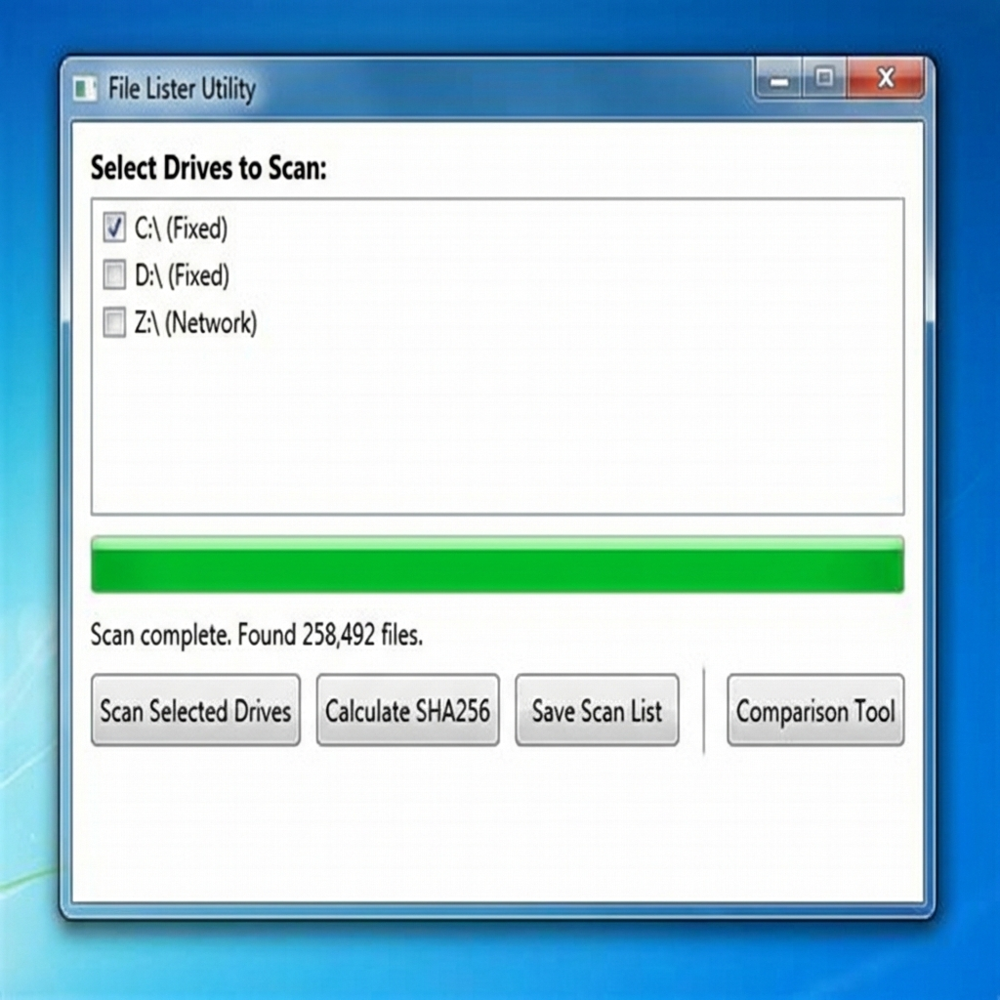

# File Lister Utility

A powerful C# WPF application for auditing, scanning, and comparing file systems.

## Download

[Download v1.0.1](https://github.com/dparksports/FileListerUtility/releases/download/v1.0.1/FileLister_v1.0.1.zip)

## Features

- **Multi-Drive Scanning**: Recursively scan local fixed drives and network locations.
- **Fast Traversal**: Efficient file enumeration.
- **SHA256 Checksums**: Calculate cryptographic hashes for files to ensure integrity.
- **Comprehensive Reporting**: Export file lists with full details including:
  - File Path
  - SHA256 Checksum
  - Calculation Timestamp
  - File Size
  - Creation, Last Write, and Last Access Timestamps
  - File Attributes
- **Comparison Tools**:
  - Compare two scans to identify added, missing, or removed files.
  - Compare checksum reports to detect modified files.

## Getting Started

1. **Build**: Open the solution in Visual Studio or run `dotnet build`.
2. **Run**: Execute `FileLister.exe`.
3. **Scan**: Select drives and click "Scan Selected Drives".
4. **Process**: Calculate checksums or save the list directly.
5. **Compare**: Use the "Comparison Tool" to analyze differences between reports.

## License

This project is licensed under the Apache License 2.0 - see the [LICENSE](LICENSE) file for details.
